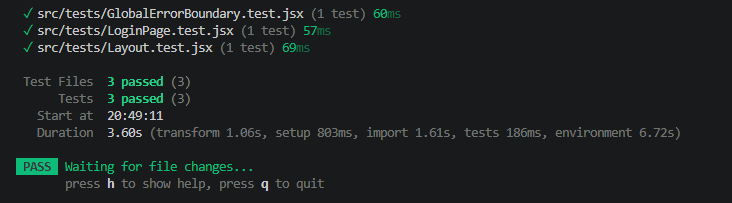

# DEV1003 - Advanced Applications - Assessment 3 - Construct a Front-end Web Application

## Courtney Macgregor - Lorena Borges Amaral - Simona Chiapperino

### GitHub Repository: [https://github.com/lorenaborges256/DEV1003_A3_FrontEnd_GAMS](https://github.com/lorenaborges256/DEV1003_A3_FrontEnd_GAMS)

---

## MERN Project - Guild Availability Management System (GAMS)

## Project Overview

The **Guild Availability Management System (GAMS)** front‑end is a responsive React application built for DEV1003 — Advanced Applications, providing the user interface for a MERN‑based system that supports guild members and administrators in managing items, contracts, watchlists, notifications, and dashboards. Developed with React, Vite, React Router, and SCSS Modules, the application delivers a modular, accessible, and intuitive experience through reusable components, nested routing, and a dedicated layout structure. It includes a Global Error Boundary for graceful error handling and Vitest‑based unit tests to ensure reliability, while ESLint (Airbnb rules) and Prettier enforce a consistent, professional code style. Designed to operate independently as a complete client application, this front‑end is fully prepared for integration with the existing REST API and reflects modern front‑end engineering practices aligned with the assessment requirements.

## 1. Technologies

The technologies used in this project reflect the tools and practices taught throughout DEV1003 — Advanced Applications at Coder Academy. Each dependency was selected in alignment with the course curriculum, ensuring that the stack represents current industry standards and prepares the team for professional software development environments.

### 1.1 Hardware Requirements

GAMS is a web-based REST API and has no specialised hardware requirements. Any machine capable of running a modern operating system (Windows 10+, macOS 12+, or Ubuntu 20.04+) with at least **4 GB of RAM** and a stable internet connection is sufficient to develop, run, and test the application. No GPU, dedicated storage device, or proprietary hardware is required.

### 1.2 Software Requirements

The GAMS project relies on a collection of modern front‑end technologies, software tools, and npm packages that together support the development, styling, testing, and deployment of the GAMS React application. The following section outlines all required software and dependencies, explains the purpose of each technology, compares them with alternative options considered during development, and identifies the licensing associated with each package.

The following software must be installed to run the application locally:

| Software | Version | Purpose |
| --- | --- | --- |
| Node.js | v18+ | JavaScript runtime that executes the server-side application |
| npm | v9+ | Package manager used to install all project dependencies and run scripts|
| Git | Any | Version control for cloning and managing the repository |

### 1.2.1 Production Dependencies Packages

The following packages are installed as runtime dependencies and are required for the application to function in production.

| Package | Purpose in GAMS | Why Chosen Over Alternatives | Alternatives Considered | License |
| --- | --- | --- | --- | --- |
| **react** | Core UI library for building components and managing state | Mature ecosystem, component model, widely adopted in industry | Vue, Angular, Svelte | MIT |
| **react-dom** | Renders React components to the DOM | Required for React SPA architecture | N/A (React-specific) | MIT |
| **react-router-dom** | Client-side routing for pages and nested layouts | Best-in-class routing for React; supports nested routes used in GAMS | Next.js routing, TanStack Router | MIT |
| **sass** | Enables SCSS Modules and global styling tokens | More powerful than plain CSS; supports variables, mixins, nesting | Tailwind CSS, Styled Components, CSS Modules only | MIT |

### 1.2.2 Development Dependencies Packages

The following packages are used only during development (Build, Testing, Linting, Tooling).

| Package | Purpose in GAMS | Why Chosen Over Alternatives | Alternatives Considered | License |
| --- | --- | --- | --- | --- |
| **vite** | Development server + build tool | Extremely fast, modern, supports React 19; better DX than CRA/Webpack | Webpack, Parcel, Create React App (deprecated) | MIT |
| **vitest** | Unit testing framework | Native Vite integration, faster than Jest, modern API | Jest, Mocha | MIT |
| **@testing-library/react** | Testing React components through user interactions | Encourages accessible, behaviour‑driven tests | Enzyme (deprecated), Cypress (E2E only) | MIT |
| **eslint** | Linting for code quality | Industry standard; integrates with Airbnb rules | JSHint, StandardJS | MIT |
| **eslint-config-airbnb-base** | Enforces Airbnb JavaScript style guide | Widely respected, encourages clean and consistent code | StandardJS, Google Style Guide | MIT |
| **eslint-plugin-react-hooks** | Ensures correct use of React hooks | Prevents common hook misuse errors | None (React-specific) | MIT |
| **eslint-plugin-react-refresh** | Enables fast refresh during development | Improves DX with instant component updates | None (Vite-specific) | MIT |
| **eslint-config-prettier** | Prevents conflicts between ESLint and Prettier | Ensures formatting and linting work together | None | MIT |
| **prettier** | Code formatting | Enforces consistent formatting across the project | Beautify, StandardJS | MIT |

### 1.2.3 Technology Choices Justification

The technologies selected for the GAMS front‑end were chosen to support a modern, maintainable, and scalable single‑page application that meets the requirements of DEV1003 — Advanced Applications. Each tool was evaluated against alternatives to ensure the best balance of performance, developer experience, and long‑term sustainability.

**React** was chosen as the core UI library due to its component‑driven architecture, strong ecosystem, and industry adoption. Its declarative model and support for hooks make it well‑suited for building reusable, stateful components across both user and admin interfaces. Alternatives such as Vue and Angular were considered; however, React offered greater flexibility and aligned more closely with the MERN stack used in previous assessments.

**Vite** was selected as the build tool and development server because of its exceptional speed, modern architecture, and seamless integration with React. Compared to older tools like Webpack or Create React App, Vite provides faster hot module replacement, simpler configuration, and a more efficient production build pipeline, improving both development workflow and performance.

**React Router** was chosen to manage client‑side navigation, enabling nested routes, protected layouts, and role‑specific views. Its mature API and compatibility with React’s component model made it a better fit than alternatives such as Next.js routing (which requires a different project structure) or TanStack Router (which is newer and less widely adopted).

**SCSS Modules** were used for styling to provide locally scoped styles, maintainable structure, and access to variables, mixins, and nesting. This approach offers more control than utility‑first frameworks like Tailwind CSS and avoids the runtime overhead of CSS‑in‑JS solutions such as Styled Components. SCSS Modules also integrate cleanly with Vite and support a scalable design system.

**Vitest** and **React Testing Library** were chosen for testing due to their modern APIs, fast execution, and compatibility with Vite. Vitest offers a more efficient developer experience than Jest when used in Vite projects, while React Testing Library encourages accessible, behaviour‑driven testing practices. Together, they support the assessment requirement for validating essential application functionality.

Finally, **ESLint (Airbnb rules)** and **Prettier** were selected to enforce a consistent coding style and maintain high code quality. The Airbnb style guide is widely respected and encourages best practices in JavaScript and React development. Prettier ensures consistent formatting across the codebase, reducing friction in collaboration and improving readability.

Collectively, these technologies were chosen to create a front‑end that is fast, reliable, maintainable, and aligned with modern industry standards, while also meeting the functional and technical requirements of the assessment.

### 1.4 HTTP Communication Features

GAMS uses all four industry-standard HTTP communication features throughout the API, applied correctly and consistently across all routes.

| Feature | What It Is | Where Used in GAMS | Example |
| --- | --- | --- | --- |
| **Headers** | Metadata sent alongside an HTTP request, separate from the URL and body | `src/middleware/verifyToken.js` — reads the `Authorization` header on every protected request to extract and validate the JWT token | `request.headers.authorization` → `"Bearer <token>"` |
| **Body Content** | The data payload sent inside `POST` and `PUT` requests, parsed as JSON | All `POST` and `PUT` route handlers — used to receive data for creating users, items, contracts, watchlist entries, and notifications | `const { name, email, password } = request.body` in `authController.js` |
| **Params** | Values embedded directly in the URL path to identify a specific resource | All `GET /:id`, `PUT /:id`, and `DELETE /:id` routes — used to look up a single document in the database for reservations, users, notifications, and watchlist entries | `request.params.id` in `reservationController.js`, `adminController.js`, `notificationRoutes.js` |
| **Authorization** | Controlling which users can access which endpoints based on identity and role | Applied via two middleware functions chained on route definitions: `verifyToken` (authenticated users) and `isAdmin` (admin-only routes) | `router.delete('/users/:id', verifyToken, isAdmin, deleteUser)` in `adminRoutes.js` |

### 1.5 HTTP Verbs and CRUD Operations

GAMS uses four industry-standard HTTP verbs across 28 route definitions spanning nine entities. Every verb is applied correctly and consistently, matching its universally agreed CRUD meaning. No verb is misused — for example, no `GET` route modifies data, and no `DELETE` route is used for anything other than removal.

| HTTP Verb | CRUD Operation | Role in GAMS |
| --- | --- | --- |
| `GET` | Read | Retrieve lists and single records |
| `POST` | Create / Trigger | Create new resources or trigger actions with side effects |
| `PUT` | Update | Replace or update an existing resource by `:id` |
| `DELETE` | Delete | Remove a resource permanently |

## 2. DRY Principles

The GAMS front‑end applies DRY (Don’t Repeat Yourself) principles across its component architecture, routing structure, styling system, and error‑handling strategy. Shared logic is centralised into reusable components, hooks, and layout structures, ensuring that UI patterns, navigation logic, and styling conventions are defined once and reused consistently throughout the application. This reduces duplication, improves maintainability, and supports a scalable front‑end codebase.

| Pattern | Where Applied | How It Avoids Repetition |
| --- | --- | --- |
| **Global Layout System** | ``src/components/layout/Layout.jsx`` | The sidebar, header, and authenticated page structure are defined once and reused across all user and admin pages through React Router’s ``<Outlet>`` mechanism. |
| **Reusable UI Components** | ``src/components/`` | Shared UI elements (e.g., navigation links, cards, layout elements) are implemented once and imported wherever needed, preventing duplicated markup and styling. |
| **SCSS Modules + Global Variables** | ``src/styles/`` | Design tokens (colors, spacing, typography) are defined once and reused across all components, ensuring consistent styling without repeated CSS values. |
| **Centralised Error Handling** | ``src/components/GlobalErrorBoundary.jsx`` | The Global Error Boundary wraps the entire application, providing a single fallback UI for all rendering errors instead of duplicating error handling in each component. |
| **Routing Structure** | ``src/main.jsx`` | Nested routes and shared layout wrappers prevent repeated route definitions and avoid duplicating navigation logic across pages. |
| **Testing Utilities** | ``src/tests/`` | Reusable testing patterns (rendering helpers, accessibility queries) ensure consistent test structure without rewriting boilerplate for each test file. |

## 3. Code Style & Linting

The GAMS front‑end maintains a consistent, professional, and readable codebase through the combined use of ESLint for static analysis and Prettier for automatic formatting. These tools ensure that all React components, hooks, styles, and test files follow a unified style guide, reducing errors and improving maintainability across the project.

### ESLint

ESLint is configured in `eslint.config.js` using the flat config system introduced in ESLint 10. The configuration extends several rule sets that enforce best practices across the React front‑end:

- **@eslint/js recommended** — enforces core JavaScript best practices, such as flagging undeclared variables and unreachable code.
- **eslint-plugin-react-hooks recommended** — enforces the Rules of Hooks, ensuring useState, useEffect, and other hooks are called correctly and consistently.
- **eslint-plugin-react-refresh** — prevents patterns that break Vite's Hot Module Replacement (HMR) during development.
- **eslint-config-prettier**— disables all ESLint formatting rules that would conflict with Prettier, ensuring the two tools never produce contradictory output.

The following custom rules are also applied:

| Rule             | Level   | Purpose                                                         |
| :--------------- | :------ | :-------------------------------------------------------------- |
| `no-unused-vars` | Warning | Flags variables that are declared but never used                |
| `no-console`     | Warning | Discourages leaving `console.log` statements in production code |

To run the linter across the entire project:

```bash
npm run lint
```

### Prettier

Prettier is configured via .prettierrc with the following rules:

| Rule            | Value   | Effect                                                              |
| :-------------- | :------ | :------------------------------------------------------------------ |
| `semi`          | `true`  | Semicolons are always added at the end of statements                |
| `singleQuote`   | `true`  | Single quotes are used instead of double quotes                     |
| `tabWidth`      | `2`     | Code is indented with 2 spaces                                      |
| `trailingComma` | `"es5"` | Trailing commas are added where valid in ES5 (objects, arrays)      |
| `printWidth`    | `100`   | Lines are wrapped at 100 characters                                 |
| `endOfLine`     | `"lf"`  | Unix-style line endings are enforced for cross-platform consistency |

Prettier ignores node_modules/, dist/, and package-lock.json as defined in .prettierignore.
To automatically format all source files:

```bash
npm run format
```

## 4. Testing

The GAMS front‑end uses **Vitest** as its test runner, configured with the **jsdom** environment to simulate a browser-like **DOM**. This allows React components to be tested without requiring a real browser. **React Testing Library** `(@testing-library/react)` is used to render components and interact with them in a way that reflects real user behaviour, while `@testing-library/jest-dom` extends Vitest with readable assertions such as `toBeInTheDocument()`.

All tests are located in the `src/tests/` directory and can be executed with:

```bash
npm test
```

The testing strategy follows a practical, component‑focused approach, which is the recommended methodology for modern React applications. Instead of aiming for full coverage or complex mocking, the tests focus on verifying that essential UI components render correctly, display expected content, and behave predictably when interacted with. This keeps the test suite lightweight, fast, and easy to maintain. Some of the tests include:

- `GlobalErrorBoundary.test.jsx` — ensures the Global Error Boundary catches rendering errors and displays the fallback UI.

- `LoginPage.test.jsx` — verifies that the login page renders without crashing and contains expected text elements.

- `Layout.test.jsx` — checks that the main layout renders shared UI elements such as the header and sidebar navigation.

This approach ensures that the most critical parts of the user interface behave reliably, supports the assessment requirement for demonstrating testing competency, and provides a solid foundation for future expansion as the application grows.



## 5. Error Handling

The GAMS front‑end implements a **centralised error‑handling strategy** using a Global Error Boundary that wraps the entire application. This ensures that unexpected rendering errors anywhere in the component tree are caught and handled gracefully, preventing the application from crashing and providing users with a clear, consistent fallback interface.

The Global Error Boundary `(src/components/GlobalErrorBoundary.jsx)` monitors all child components for runtime rendering errors. When an error occurs, React automatically unmounts the faulty component tree and replaces it with the boundary’s fallback UI. This prevents blank screens, broken layouts, or unhandled exceptions from reaching the user. The boundary also logs the error details to the console for debugging while ensuring no sensitive internal information is exposed in the UI.

Although front‑end applications do not use HTTP status codes like a backend API, the Global Error Boundary effectively covers the major categories of client‑side failures that can occur in a React application:

| Error Category | Trigger | How It Is Handled |
| --- | --- | --- |
| **Rendering errors** | Component throws during render, lifecycle, or hooks | Caught by Global Error Boundary → fallback UI displayed |
| **Invalid component state** | Unexpected ``undefined`` or null values passed to components | Boundary catches the resulting render error |
| **Broken props or missing data** | Component receives malformed or incomplete props | Boundary prevents the app from crashing and shows fallback |
| **Third‑party component failures** | Errors thrown by external libraries used inside components | Boundary isolates the failure and prevents full app crash |
| **Unexpected runtime errors** | Any unhandled exception during rendering | Boundary logs the error and displays fallback UI |

This approach ensures that any failure in the UI layer is contained, providing a stable and predictable user experience even when unexpected issues occur.

The error‑handling flow for the front‑end is:


- A component attempts to render.
- If an error is thrown during rendering, React passes it to the nearest Error Boundary.
- The Global Error Boundary logs the error for developers.
- The user sees a friendly fallback message instead of a broken UI.
- The rest of the application continues functioning normally.

This strategy aligns with modern React best practices and meets the assessment requirement for graceful, centralised error handling in a front‑end application.

## 7. Getting Started

### 7.1 Pre requisites

### 7.2 Installation

1.Clone the repository:

```bash
git clone 
cd 
```

2.Install dependencies:

```bash
npm install
```

3.Create a .env file in the project root:

4.Start the development server:

```bash
npm run dev
```

5.Run the automated tests:

```bash
npm test
```

## 8. Conclusion

GAMS demonstrates a complete, production-ready REST API built on the MERN stack, implementing secure role-based authentication, full CRUD operations across nine entities, centralised error handling, and automated test coverage across the application's core functionality. Every architectural decision — from the MVC pattern and Airbnb style guide to the choice of JWT over session-based auth — was made deliberately and is documented in this README. The codebase is designed to serve as the back-end foundation for the GAMS React front-end, with all endpoints structured and secured in anticipation of that integration.
