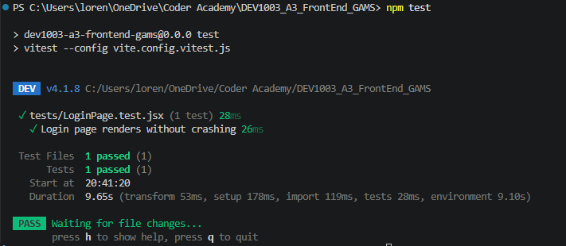

# DEV1003 - Advanced Applications - Assessment 3 - Construct a Front-end Web Application

## Courtney Macgregor - Lorena Borges Amaral

### GitHub Repository: [https://github.com/lorenaborges256/DEV1003_A3_FrontEnd_GAMS](https://github.com/lorenaborges256/DEV1003_A3_FrontEnd_GAMS)

---

## MERN Project - Guild Availability Management System (GAMS)

## Project Overview

The **Guild Availability Management System (GAMS)** is a MERN full-stack application developed as part of DEV1003 — Advanced Applications at Coder Academy. It is a REST API built with Node.js, Express, and MongoDB that manages the operations of a fictional guild — allowing members to browse and reserve items, accept time-limited contracts, and receive notifications when watched items or contracts become available. The API implements role-based access control with two user levels (Guild Member and Guild Administrator), stateless JWT authentication, and a centralised error handling strategy. It is designed to serve as the data and logic layer for a React front-end, with all endpoints structured, secured, and documented in anticipation of that integration.

## 1. Technologies

The technologies used in this project reflect the tools and practices taught throughout DEV1003 — Advanced Applications at Coder Academy. Each dependency was selected in alignment with the course curriculum, ensuring that the stack represents current industry standards and prepares the team for professional software development environments.

### 1.1 Hardware Requirements

GAMS is a web-based REST API and has no specialised hardware requirements. Any machine capable of running a modern operating system (Windows 10+, macOS 12+, or Ubuntu 20.04+) with at least **4 GB of RAM** and a stable internet connection is sufficient to develop, run, and test the application. No GPU, dedicated storage device, or proprietary hardware is required.

### 1.2 Software Requirements

The following software must be installed to run the application locally:

| Software | Version | Purpose |
| --- | --- | --- |
| Node.js | v18+ | JavaScript runtime that executes the server-side application |
| npm | v9+ | Package manager used to install all project dependencies |
| MongoDB Atlas | Cloud (free tier) | Hosted NoSQL database service — no local MongoDB installation required |
| Git | Any | Version control for cloning and managing the repository |

### 1.2.1 Production Dependencies Packages

The following packages are installed as runtime dependencies and are required for the application to function in production.

| Package | Purpose in GAMS | Why Chosen Over Alternatives | Alternative Considered | License |
| --- | --- | --- | --- | --- |
| `express ^5.2.1` | Web server framework — handles all HTTP routing, middleware registration, and request/response management | Mature ecosystem, industry standard, and aligns with course curriculum | **Fastify** — higher raw throughput but smaller ecosystem and less course alignment | MIT |
| `mongoose ^9.6.2` | MongoDB ODM — defines all data schemas, enforces validation rules, and manages the Atlas connection | Schema-based approach enforces data integrity at the application layer, essential for managing reservations and contracts | **MongoDB Native Driver** — lower-level control but no built-in schema validation | MIT |
| `jsonwebtoken ^9.0.3` | Generates signed JWT tokens on login/register and verifies them on every protected route via `verifyToken` middleware | Stateless authentication — the server stores no session data, making the API scalable and suited for a decoupled MERN architecture | **express-session** — session-based auth requires server-side session storage, less suitable for a separate React front-end | MIT |
| `bcrypt ^6.0.0` | Hashes all user passwords before saving to the database and compares plain-text passwords against stored hashes during login | Native C++ bindings offer superior performance over pure JavaScript implementations | **bcryptjs** — pure JavaScript, no native bindings, slower performance | MIT |
| `cors ^2.8.6` | Enables the React front-end (running on a different port) to communicate with the Express API without being blocked by the browser | Standard industry approach; the alternative of setting headers manually is error-prone and verbose | **Manual CORS headers** — possible but not recommended for maintainability | MIT |
| `dotenv ^17.4.2` | Loads environment variables from `.env` into `process.env`, keeping secrets (DB URI, JWT secret) out of source code | Portable and developer-friendly across all operating systems | **OS-level environment variables** — works but requires manual setup on every machine and does not scale across a team | BSD 2-Clause |

### 1.2.2 Development Dependencies Packages

The following packages are used only during development and testing and are not included in the production build.

| Package | Purpose in GAMS | Why Chosen Over Alternatives | Alternative Considered | License |
| --- | --- | --- | --- | --- |
| `jest ^30.4.2` | Test runner — executes all test files in `src/tests/`, provides `describe`, `it`, `expect`, and `beforeAll`/`afterAll` lifecycle hooks | All-in-one solution requiring minimal configuration; current industry default for Node.js and React projects | **Mocha + Chai** — separates test runner from assertion library, requires more configuration | MIT |
| `supertest ^7.2.2` | Makes real HTTP requests against the Express app in tests without starting a live server | Integrates directly with the Express app instance, making tests faster and fully isolated | **Axios with a running test server** — requires the server to be started separately, slower and less isolated | MIT |
| `nodemon ^3.1.14` | Watches the file system and automatically restarts the server whenever a source file is saved during development | Greater configurability and broader compatibility than the built-in Node.js watch flag | **Node.js `--watch` flag** — available since Node 18 but less configurable | MIT |
| `eslint ^8.57.1` + `eslint-config-airbnb-base` | Static analysis tool configured with the Airbnb Base style guide to enforce consistent code formatting and catch potential errors across all files | Enforces both style and code quality rules, not just formatting; Airbnb Base is one of the most widely adopted JS style guides | **Prettier** — formats code but does not enforce code quality rules such as unused variables or incorrect imports | MIT |

### 1.3 External Libraries

### Prettier and the ESLint/Prettier bridge

| Package                  | Purpose                                                                   |
| :----------------------- | :------------------------------------------------------------------------ |
| `prettier`               | The code formatter itself                                                 |
| `eslint-config-prettier` | Turns off all ESLint rules that would conflict with Prettier's formatting |


### .prettierrc

| Rule                     | What it means                                              |
| :----------------------- | :--------------------------------------------------------- |
| `"semi": true`           | Always add semicolons at end of statements                 |
| `"singleQuote": true`    | Use single quotes instead of double quotes                 |
| `"tabWidth": 2`          | Indent with 2 spaces                                       |
| `"trailingComma": "es5"` | Add trailing commas where valid in ES5 (objects, arrays)   |
| `"printWidth": 100`      | Wrap lines at 100 characters                               |
| `"endOfLine": "lf"`      | Use Unix line endings (important for cross-platform teams) |


GAMS uses ten external libraries across production and development. Every library is imported using `require()` at the top of the file where it is needed, following the CommonJS module standard defined by `"type": "commonjs"` in `package.json`. No library is imported mid-function, imported but unused, or imported globally when only needed in one place.

The four core libraries that underpin the application's functionality are:

| Library | Where Imported | How It Is Used |
| --- | --- | --- |
| `express` | `src/server.js` and all route files | Creates the application instance, registers global middleware (`cors`, `express.json()`), mounts all route modules, and creates individual `Router` instances for each entity |
| `mongoose` | `src/config/db.js` and all model files | Establishes and manages the MongoDB Atlas connection, defines all data schemas (User, Item, Contract, etc.), enforces field-level validation, and compiles schemas into models used throughout the application |
| `jsonwebtoken` | `src/controllers/authController.js` and `src/middleware/verifyToken.js` | Signs a new JWT with `jwt.sign()` on every successful registration and login, and verifies the token with `jwt.verify()` on every protected request via the `verifyToken` middleware |
| `bcrypt` | `src/models/User.js` | Hashes all user passwords before they are saved to the database via a `pre('save')` hook using `bcrypt.hash()`, and validates plain-text passwords against stored hashes during login using `bcrypt.compare()` |

The remaining libraries each serve a focused, well-defined role. `cors` is applied as global middleware in `server.js` to allow cross-origin requests from the React front-end. `dotenv` is loaded in `index.js` to inject environment variables from `.env` into `process.env`, keeping sensitive values such as the database URI and JWT secret out of the source code. On the development side, `jest` serves as the test runner for all files in `src/tests/`, providing the `describe`, `it`, `expect`, and lifecycle hooks used across every test suite. `supertest` is imported in every test file to make real HTTP requests directly against the Express app instance without starting a live server. `nodemon` is configured as the `dev` script to automatically restart the server on file changes during development. Finally, `eslint` together with `eslint-config-airbnb-base` and `eslint-plugin-import` enforces the Airbnb Base style guide across all source files via the `npm run lint` script.

### 1.4 HTTP Communication Features

GAMS uses all four industry-standard HTTP communication features throughout the API, applied correctly and consistently across all routes.

| Feature | What It Is | Where Used in GAMS | Example |
| --- | --- | --- | --- |
| **Headers** | Metadata sent alongside an HTTP request, separate from the URL and body | `src/middleware/verifyToken.js` — reads the `Authorization` header on every protected request to extract and validate the JWT token | `request.headers.authorization` → `"Bearer <token>"` |
| **Body Content** | The data payload sent inside `POST` and `PUT` requests, parsed as JSON | All `POST` and `PUT` route handlers — used to receive data for creating users, items, contracts, watchlist entries, and notifications | `const { name, email, password } = request.body` in `authController.js` |
| **Params** | Values embedded directly in the URL path to identify a specific resource | All `GET /:id`, `PUT /:id`, and `DELETE /:id` routes — used to look up a single document in the database for reservations, users, notifications, and watchlist entries | `request.params.id` in `reservationController.js`, `adminController.js`, `notificationRoutes.js` |
| **Authorization** | Controlling which users can access which endpoints based on identity and role | Applied via two middleware functions chained on route definitions: `verifyToken` (authenticated users) and `isAdmin` (admin-only routes) | `router.delete('/users/:id', verifyToken, isAdmin, deleteUser)` in `adminRoutes.js` |

### 1.5 HTTP Verbs and CRUD Operations

GAMS uses four industry-standard HTTP verbs across 28 route definitions spanning nine entities. Every verb is applied correctly and consistently, matching its universally agreed CRUD meaning. No verb is misused — for example, no `GET` route modifies data, and no `DELETE` route is used for anything other than removal.

| HTTP Verb | CRUD Operation | Role in GAMS |
| --- | --- | --- |
| `GET` | Read | Retrieve lists and single records |
| `POST` | Create / Trigger | Create new resources or trigger actions with side effects |
| `PUT` | Update | Replace or update an existing resource by `:id` |
| `DELETE` | Delete | Remove a resource permanently |

## 2. DRY Principles

GAMS applies DRY (Don't Repeat Yourself) principles throughout the entire codebase. Repeated logic is extracted into shared modules that are imported wherever needed, rather than duplicated across files.

| Pattern | Where Applied | How It Avoids Repetition |
| --- | --- | --- |
| Centralised error handler | `src/middleware/errorHandler.js` | All eight error categories are handled in one file, imported once in `server.js` — no error handling logic is repeated in controllers |
| `verifyToken` middleware | `src/middleware/verifyToken.js` | JWT verification logic is written once and applied to all 25+ protected routes as a single middleware reference |
| `isAdmin` middleware | `src/middleware/isAdmin.js` | Role-checking logic is written once and reused across all admin-only routes |
| `generateToken` helper | `src/controllers/authController.js` | JWT signing logic is extracted into one function used by both `register` and `login` handlers |
| Controller / Route separation | All entities | Business logic lives in controllers, not inline in route files — each controller function is written once and referenced by its route |
| Consistent `try/catch` pattern | All controllers | Every async controller follows the same `try { ... } catch (err) { return next(err); }` pattern, keeping error forwarding consistent without repetition |


## 3. Code Style & Linting

This project enforces a consistent code style across all files using ESLint for static analysis and Prettier for automatic formatting. Both tools are configured to work together without conflicts.

### ESLint

ESLint is configured using the modern flat config format (eslint.config.js), which is the default for ESLint 10 and Vite-generated projects. The configuration extends three rule sets:
- **@eslint/js recommended** — enforces core JavaScript best practices, such as flagging undeclared variables and unreachable code.
- **eslint-plugin-react-hooks recommended** — enforces the Rules of Hooks, ensuring useState, useEffect, and other hooks are called correctly and consistently.
- **eslint-plugin-react-refresh** — prevents patterns that break Vite's Hot Module Replacement (HMR) during development.
- **eslint-config-prettier **— disables all ESLint formatting rules that would conflict with Prettier, ensuring the two tools never produce contradictory output.

The following custom rules are also applied:

| Rule             | Level   | Purpose                                                         |
| :--------------- | :------ | :-------------------------------------------------------------- |
| `no-unused-vars` | Warning | Flags variables that are declared but never used                |
| `no-console`     | Warning | Discourages leaving `console.log` statements in production code |

To run the linter across the entire project:

```bash
npm run lint
```

### Prettier

Prettier is configured via .prettierrc with the following rules:
| Rule            | Value   | Effect                                                              |
| :-------------- | :------ | :------------------------------------------------------------------ |
| `semi`          | `true`  | Semicolons are always added at the end of statements                |
| `singleQuote`   | `true`  | Single quotes are used instead of double quotes                     |
| `tabWidth`      | `2`     | Code is indented with 2 spaces                                      |
| `trailingComma` | `"es5"` | Trailing commas are added where valid in ES5 (objects, arrays)      |
| `printWidth`    | `100`   | Lines are wrapped at 100 characters                                 |
| `endOfLine`     | `"lf"`  | Unix-style line endings are enforced for cross-platform consistency |

Prettier ignores node_modules/, dist/, and package-lock.json as defined in .prettierignore.
To automatically format all source files:

```bash
npm run format
```

## 4. Testing

This project uses Vitest as the test runner, configured with the jsdom environment to simulate a browser DOM without requiring a real browser. React Testing Library (@testing-library/react) is used to render components and query the DOM, and @testing-library/jest-dom extends Vitest's matchers with readable assertions such as toBeInTheDocument(). Tests are located in the tests/ directory and can be run with npm test.
The testing strategy follows a practical, component-focused approach as recommended for React front-end projects. Tests verify that key components and pages render correctly and contain the expected elements, without requiring complex mocking, end-to-end flows, or full code coverage. This keeps the test suite lightweight, fast, and maintainable. Examples of tests included in this project are confirming that the Login page renders without crashing and that interactive elements such as form inputs and buttons behave as expected when interacted with.




## 5. Error Handling

GAMS handles all categories of errors gracefully through a **centralised global error handler** registered as the last middleware in `server.js` (`src/middleware/errorHandler.js`). Every controller wraps its logic in a `try/catch` block and forwards any error to this handler via `next(err)`, ensuring the server never crashes and always returns a structured JSON response with a meaningful message and the correct HTTP status code. Sensitive internal details such as stack traces are never exposed to the client.

The following eight error categories are handled:

| Error Category | HTTP Status | Trigger | Handler |
| --- | --- | --- | --- |
| Validation failure | 400 | Missing or invalid request body fields (Mongoose `ValidationError`) | `errorHandler.js` → `handleValidationError` |
| Invalid ID | 400 | Malformed `:id` param that cannot be cast to a MongoDB ObjectId (`CastError`) | `errorHandler.js` → `handleCastError` |
| Unauthorized | 401 | Missing or absent `Authorization` header | `verifyToken.js` |
| Invalid token | 401 | Malformed or tampered JWT (`JsonWebTokenError`) | `errorHandler.js` → `handleJWTError` |
| Expired token | 401 | JWT past its 7-day expiry (`TokenExpiredError`) | `errorHandler.js` → `handleJWTExpiredError` |
| Forbidden | 403 | Authenticated user lacks the `admin` role | `isAdmin.js` |
| Not found | 404 | Requested document does not exist in the database | Each controller via `next({ status: 404 })` |
| Duplicate key | 409 | Unique-indexed field (e.g. `email`) already exists in the collection | `errorHandler.js` → `handleDuplicateKeyError` |
| Unexpected error | 500 | Any unhandled runtime error | `errorHandler.js` default fallback |

Here is the error handling flow diagram for GAMS. It traces the full journey of a request from the client through every layer of error detection, showing all eight error categories and their corresponding HTTP status codes.
The diagram reads top to bottom:

1. Every request first hits verifyToken — three JWT error paths branch off here (401)
2. Admin-required routes then pass through isAdmin — a 403 branches off here
3. The controller's try/catch block handles the happy path (200/201) and forwards failures to the global error handler
4. The global errorHandler.js detects the error type and routes it to the correct response (400, 404, 409, or 500)


## 6. Database Schema and Entity Relationships

The Entity Relationship Diagram (ERD) above is the foundation from which the entire API is derived. Each entity in the ERD maps directly to three files in the codebase: a **model file** that defines the Mongoose schema and enforces field-level validation, a **controller file** that contains one function per endpoint (the business logic), and a **route file** that maps each HTTP verb and URL path to its corresponding controller function. All route files are registered centrally in `server.js`, giving the application a single, consistent entry point for every request. Understanding the entities and their relationships is therefore essential to understanding the API — every endpoint exists because an entity in the ERD requires it, and every controller function exists because a user story demands an action on that entity.

1. User
2. Item
3. Contract
4. Reservation
5. Contract Acceptance
6. Watchlist
7. Notification


### 1. User

The central entity of the system. Every action — reserving an item, accepting a contract, watching, or receiving a notification — is tied to a User.

| Field | Key | Type | Notes |
| :--- | :---: | :--- | :--- |
| `user_id` | PK | ObjectId | Auto-generated by MongoDB (`_id`) |
| `name` | | String | Required |
| `email` | | String | Required, unique |
| `role` | | String | `"user"` or `"admin"` — drives role-based authorisation |
| `password` | | String | Required, stored as a bcrypt hash |
| `created_at` | | Date | Defaults to `Date.now` |

**Relationships:** One User has many Reservations, ContractAcceptances, Watchlist entries, and Notifications.

### 2. Item

An inventory-based artifact that users can reserve while stock is available. When `stock_qty` reaches zero the item becomes unavailable and users may add it to their Watchlist.

| Field | Key | Type | Notes |
| :--- | :---: | :--- | :--- |
| `item_id` | PK | ObjectId | Auto-generated by MongoDB (`_id`) |
| `name` | | String | Required |
| `description` | | String | |
| `stock_qty` | | Number | Required; decremented on each Reservation |
| `created_at` | | Date | Defaults to `Date.now` |
| `updated_at` | | Date | Updated on every stock change |

**Relationships:** One Item has many Reservations. Referenced by Watchlist and Notification via the `Target` entity.

### 3. Contract

A time-windowed quest that users can accept within a defined availability window and while `current_acceptances` is below `max_acceptances`.

| Field | Key | Type | Notes |
| :--- | :---: | :--- | :--- |
| `contract_id` | PK | ObjectId | Auto-generated by MongoDB (`_id`) |
| `title` | | String | Required |
| `description` | | String | |
| `start_at` | | Date | Required; contract becomes available from this datetime |
| `end_at` | | Date | Required; contract closes at this datetime |
| `max_acceptances` | | Number | Required; maximum number of users who can accept |
| `current_acceptances` | | Number | Incremented on each ContractAcceptance |
| `reward_description` | | String | Instructions for collecting the reward in person |
| `created_at` | | Date | Defaults to `Date.now` |

**Relationships:** One Contract has many ContractAcceptances. Referenced by Watchlist and Notification via the `Target` entity.

### 4. Reservation

Created when a User reserves an Item. Stores the generated reservation number used for in-person payment and collection at the guild.

| Field | Key | Type | Notes |
| :--- | :---: | :--- | :--- |
| `reservation_id` | PK | ObjectId | Auto-generated by MongoDB (`_id`) |
| `user_id` | FK | ObjectId | References `User` |
| `item_id` | FK | ObjectId | References `Item` |
| `reservation_number` | | String | Auto-generated unique identifier for in-person collection |
| `created_at` | | Date | Defaults to `Date.now` |

**Relationships:** Belongs to one User and one Item.

### 5. ContractAcceptance

Created when a User accepts a Contract within its active time window. Stores the instructions the user presents to the guild upon completion.

| Field | Key | Type | Notes |
| :--- | :---: | :--- | :--- |
| `cacceptance_id` | PK | ObjectId | Auto-generated by MongoDB (`_id`) |
| `user_id` | FK | ObjectId | References `User` |
| `contract_id` | FK | ObjectId | References `Contract` |
| `accept_at` | | Date | Timestamp of acceptance; defaults to `Date.now` |
| `instructions` | | String | Directions generated at acceptance for in-person reward collection |

**Relationships:** Belongs to one User and one Contract.

### 6. Watchlist

Created when a User watches an unavailable Item or Contract. The `target_id` field points to the `Target` entity to identify which type of entity is being watched.

| Field | Key | Type | Notes |
| :--- | :---: | :--- | :--- |
| `watchlist_id` | PK | ObjectId | Auto-generated by MongoDB (`_id`) |
| `user_id` | FK | ObjectId | References `User` |
| `target_id` | FK | ObjectId | References `Target` (Item or Contract) |
| `created_at` | | Date | Defaults to `Date.now` |

**Relationships:** Belongs to one User. References one Target (which resolves to an Item or Contract).

### 7. Notification

Generated automatically when a watched Item is restocked or a watched Contract opens. Delivered to the User who added the item or contract to their Watchlist.

| Field | Key | Type | Notes |
| :--- | :---: | :--- | :--- |
| `notification_id` | PK | ObjectId | Auto-generated by MongoDB (`_id`) |
| `user_id` | FK | ObjectId | References `User` |
| `target_id` | FK | ObjectId | References `Target` (Item or Contract) |
| `message` | | String | Human-readable notification text |
| `status` | | String | `"unread"` or `"read"` |
| `created_at` | | Date | Defaults to `Date.now` |

**Relationships:** Belongs to one User. References one Target (which resolves to an Item or Contract).

### * Target Reference

The original ERD included a dedicated `Target` table to act as an intermediary between the Watchlist/Notification entities and the Item/Contract entities. During development, however, it became clear that Mongoose's built-in `refPath` feature could handle this relationship natively — eliminating the need for a separate collection entirely. Using `refPath`, a single `targetId` field on the Watchlist and Notification models can reference either an Item or a Contract document, with the `targetType` field (`"Item"` or `"Contract"`) telling Mongoose which collection to resolve at query time. This approach achieves the same design goal as the original `Target` table while keeping the schema simpler, reducing the number of database collections, and avoiding unnecessary joins.

### Entity Relationship Summary

| Entity | Relates To | Relationship Type |
| :--- | :--- | :--- |
| User | Reservation | One-to-Many |
| User | ContractAcceptance | One-to-Many |
| User | Watchlist | One-to-Many |
| User | Notification | One-to-Many |
| Item | Reservation | One-to-Many |
| Contract | ContractAcceptance | One-to-Many |

---

## 6.1  API Endpoints Reference

Once the ERD is solid, you derive your API endpoints. Each entity needs routes for the operations users perform on it, as described in the user stories. If an action appears in a user story, it needs an endpoint. If an entity appears in the ERD, it needs routes. If a persona has restricted access, it needs middleware. Three Sources that tell you what endpoints to build:

- ### Source 1 — User Stories (the "what")

Every user story describes an action a user needs to perform. Each action that involves data being created, read, updated, or deleted requires an endpoint.
The formula is simple:
"As a [persona], I want to [action]" → that action needs an API endpoint.
For Example:
User Story Action: Browse available items
HTTP Verb: GET
Why: Reading a list of data

- ### Source 2 — ERD (the "who" and "what connects to what")

The ERD tells you which entities exist and how they relate. Every entity in your ERD that a user interacts with needs at minimum a GET endpoint. Every entity that gets created, updated, or deleted through user actions needs the corresponding verb.
Ask these four questions for each entity:

| Question                             | If yes → add this endpoint               |
| ------------------------------------ | ---------------------------------------- |
| Does a user need to **see** this?    | `GET /entity` and `GET /entity/:id`      |
| Does a user need to **create** this? | `POST /entity`                           |
| Does a user need to **change** this? | `PUT /entity/:id` or `PATCH /entity/:id` |
| Does a user need to **remove** this? | `DELETE /entity/:id`                     |

- ### Source 3 — Access Control (the "who can do it")

The user stories define two personas — Guild Member and Guild Administrator. This tells you which endpoints are public, which require authentication, and which require admin role.

| If the action...                    | Then the endpoint is...                      |
| ----------------------------------- | -------------------------------------------- |
| Anyone can do it without logging in | Public — no middleware                       |
| Only logged-in members can do it    | Protected — needs `verifyToken`              |
| Only admins can do it               | Admin-only — needs `verifyToken` + `isAdmin` |

### GAMS — Full API Endpoint

Legend

| Symbol    | Meaning                                      |
| --------- | -------------------------------------------- |
| `—`       | No middleware required (public)              |
| `VT`      | `verifyToken` — authenticated users only     |
| `VT + IA` | `verifyToken` + `isAdmin` — admin users only |

- ### Auth — /auth

| # | Method | Path             | Access | Middleware | Description                         |
| - | ------ | ---------------- | ------ | ---------- | ----------------------------------- |
| 1 | `POST` | `/auth/register` | Public | `—`        | Register a new guild member account |
| 2 | `POST` | `/auth/login`    | Public | `—`        | Authenticate and receive a JWT      |
| 3 | `POST` | `/auth/logout`   | User   | `VT`       | Log out (client discards token)     |

- ### Items — /items

| #  | Method | Path                  | Access | Middleware | Description                              |
| -- | ------ | --------------------- | ------ | ---------- | ---------------------------------------- |
| 4  | `GET`  | `/items`              | User   | `VT`       | Browse all available items               |
| 5  | `GET`  | `/items/:id`          | User   | `VT`       | View a single item's details             |
| 6  | `POST` | `/items/:id/reserve`  | User   | `VT`       | Reserve an item (decrements stock by 1)  |
| 7  | `POST` | `/items`              | Admin  | `VT + IA`  | Create a new item                        |
| 8  | `PUT`  | `/items/:id`          | Admin  | `VT + IA`  | Update an existing item                  |

- ### Contracts — /contracts

| #  | Method  | Path                    | Access | Middleware | Description                                          |
| -- | ------- | ----------------------- | ------ | ---------- | ---------------------------------------------------- |
| 10 | `GET`   | `/contracts`            | User   | `VT`       | Browse all contracts (filter by type / availability) |
| 11 | `GET`   | `/contracts/:id`        | User   | `VT`       | View a single contract's details                     |
| 12 | `POST`  | `/contracts/:id/accept` | User   | `VT`       | Accept an available contract                         |
| 13 | `POST`  | `/contracts`            | Admin  | `VT + IA`  | Create a new contract                                |
| 14 | `PUT`   | `/contracts/:id`        | Admin  | `VT + IA`  | Edit an existing contract                            |

- ### Reservations — /reservations

| #  | Method   | Path                | Access | Middleware | Description                         |
| -- | -------- | ------------------- | ------ | ---------- | ----------------------------------- |
| 15 | `GET`    | `/reservations`     | User   | `VT`       | Get the current user's reservations |
| 16 | `GET`    | `/reservations/:id` | User   | `VT`       | Get a single reservation's details  |
| 17 | `DELETE` | `/reservations/:id` | User   | `VT`       | Cancel a reservation                |

- ### Contract Acceptances — /acceptances

| #  | Method   | Path               | Access | Middleware | Description                               |
| -- | -------- | ------------------ | ------ | ---------- | ----------------------------------------- |
| 18 | `GET`    | `/acceptances`     | User   | `VT`       | Get the current user's accepted contracts |
| 19 | `GET`    | `/acceptances/:id` | User   | `VT`       | Get a single acceptance record's details  |
| 20 | `DELETE` | `/acceptances/:id` | User   | `VT`       | Withdraw from an accepted contract        |

- ### Watchlist — /watchlist

| #  | Method   | Path             | Access | Middleware | Description                              |
| -- | -------- | ---------------- | ------ | ---------- | ---------------------------------------- |
| 21 | `GET`    | `/watchlist`     | User   | `VT`       | Get the current user's watchlist         |
| 22 | `POST`   | `/watchlist`     | User   | `VT`       | Add an item or contract to the watchlist |
| 23 | `DELETE` | `/watchlist/:id` | User   | `VT`       | Remove an entry from the watchlist       |

- ### Notifications — /notifications

| #  | Method   | Path                     | Access | Middleware | Description                          |
| -- | -------- | ------------------------ | ------ | ---------- | ------------------------------------ |
| 24 | `GET`    | `/notifications`         | User   | `VT`       | Get the current user's notifications |
| 25 | `PUT`    | `/notifications/:id/read`| User   | `VT`       | Mark a notification as read          |
| 26 | `DELETE` | `/notifications/:id`     | User   | `VT`       | Delete a notification                |

- ### Dashboard — /dashboard

| #  | Method | Path         | Access | Middleware | Description                                                                               |
| -- | ------ | ------------ | ------ | ---------- | ----------------------------------------------------------------------------------------- |
| 27 | `GET`  | `/dashboard` | User   | `VT`       | Get the current user's full summary — reservations, acceptances, and unread notifications |

- ### Admin — /admin

| #  | Method   | Path               | Access | Middleware | Description                       |
| -- | -------- | ------------------ | ------ | ---------- | --------------------------------- |
| 28 | `GET`    | `/admin/users`     | Admin  | `VT + IA`  | List all registered users         |
| 29 | `GET`    | `/admin/users/:id` | Admin  | `VT + IA`  | View a single user's full details |
| 30 | `DELETE` | `/admin/users/:id` | Admin  | `VT + IA`  | Remove a user from the system     |

## 7. Getting Started

### 7.1 Prerequisites

- Node.js v18+
- npm v9+
- A MongoDB Atlas account (free tier)
- Git

### 7.2 Installation

1.Clone the repository:

```bash
git clone https://github.com/lorenaborges256/DEV1003_A2_BackEnd_GAMS.git
cd DEV1003_A2_BackEnd_GAMS
```

2.Install dependencies:

```bash
npm install
```

3.Create a .env file in the project root:

```plain text
PORT=5000
MONGODB_URI=mongodb+srv://<username>:<password>@<cluster>.mongodb.net/<dbname>
JWT_SECRET=your_secret_key_here
NODE_ENV=development

```

4.Start the development server:

```bash
npm run dev
```

5.Run the automated tests:

```bash
npm test
```

## 8. Conclusion

GAMS demonstrates a complete, production-ready REST API built on the MERN stack, implementing secure role-based authentication, full CRUD operations across nine entities, centralised error handling, and automated test coverage across the application's core functionality. Every architectural decision — from the MVC pattern and Airbnb style guide to the choice of JWT over session-based auth — was made deliberately and is documented in this README. The codebase is designed to serve as the back-end foundation for the GAMS React front-end, with all endpoints structured and secured in anticipation of that integration.