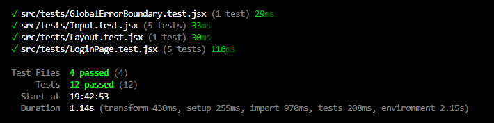
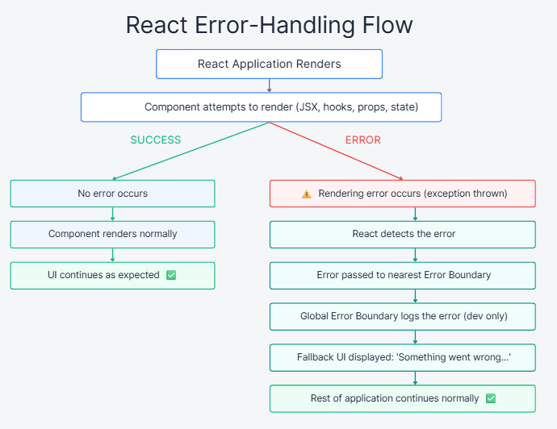

# DEV1003 - Advanced Applications - Assessment 3 - Construct a Front-end Web Application

## Courtney Macgregor - Lorena Borges Amaral - Simona Chiapperino

### GitHub Repository: [https://github.com/lorenaborges256/DEV1003_A3_FrontEnd_GAMS](https://github.com/lorenaborges256/DEV1003_A3_FrontEnd_GAMS)

---

## MERN Project - Guild Availability Management System (GAMS)

## Project Overview

The **Guild Availability Management System (GAMS)** front‑end is a responsive React application built for DEV1003 — Advanced Applications, providing the user interface for a MERN‑based system that supports guild members and administrators in managing items, contracts, watchlists, notifications, and dashboards. Developed with React, Vite, React Router, and SCSS Modules, the application delivers a modular, accessible, and intuitive experience through reusable components, nested routing, and a dedicated layout structure. It includes a Global Error Boundary for graceful error handling and Vitest‑based unit tests to ensure reliability, while ESLint (Airbnb rules) and Prettier enforce a consistent, professional code style. Designed to operate independently as a complete client application, this front‑end is fully prepared for integration with the existing REST API and reflects modern front‑end engineering practices aligned with the assessment requirements.

## 1. Technologies

The technologies used in this project reflect the tools and practices taught throughout DEV1003 — Advanced Applications at Coder Academy. Each dependency was selected in alignment with the course curriculum, ensuring that the stack represents current industry standards and prepares the team for professional software development environments.

### 1.1 Hardware Requirements

GAMS is a web-based REST API and has no specialised hardware requirements.  Any machine capable of running a modern operating system (Windows 10+, macOS 12+, or Ubuntu 20.04+) with at least **4 GB of RAM** and a stable internet connection. No GPU, dedicated storage device, or proprietary hardware is required.
Standard consumer-grade or developer-grade laptops are the industry norm for local web development. React and Vite are highly optimised, meaning high-end specifications are not necessary. While cloud environments offer consistency (such as GitHub Codespaces or AWS Cloud9), local development was chosen because it does not require continuous internet access, incurs no ongoing cloud hosting costs during development, and provides lower latency for hot-module replacement (HMR) when using Vite.

### 1.2 Software Requirements

The GAMS project relies on a collection of modern front‑end technologies, software tools, and npm packages. The following tables outline all required software, explicitly detailing their purpose, industry relevance, alternatives considered, and licensing to meet assessment requirements.

#### 1.2.1 Core Environment Tools

The following software must be installed to run and manage the application locally.

| Software | Purpose in GAMS | Industry Relevance | Alternatives Considered | License |
| :--- | :--- | :--- | :--- | :--- |
| **Node.js (v18+)** | JavaScript runtime used to execute Vite, tests, and build scripts. | The absolute industry standard runtime for modern JavaScript development and build tooling. | Deno, Bun (newer, but less stable ecosystem compared to Node.js). | MIT |
| **npm (v9+)** | Package manager used to install all project dependencies and execute `package.json` scripts. | The default and most widely used package manager in the JavaScript ecosystem. | Yarn, pnpm (npm was chosen as it is built-in to Node.js, requiring no extra setup). | Artistic License 2.0 |
| **Git** | Version control system for tracking changes, branching, and collaborating on the repository. | The undisputed industry standard for source code management. | Subversion (SVN), Mercurial (Git offers better branching models and GitHub integration). | GPL-2.0 |

#### 1.2.2 Production Dependencies

The following packages are installed as runtime dependencies and are required for the application to function in production.

| Package | Purpose in GAMS | Industry Relevance & Why Chosen | Alternatives Considered | License |
| :--- | :--- | :--- | :--- | :--- |
| **react** | Core UI library for building components and managing state. | Massive industry adoption, mature ecosystem. Chosen for its declarative model and component reusability. | Vue, Angular, Svelte | MIT |
| **react-dom** | Renders React components to the browser DOM. | Essential pairing with React for web applications. | N/A (React-specific requirement) | MIT |
| **react-router-dom** | Client-side routing for pages, navigation, and nested layouts. | The most widely used routing library in the React ecosystem. Chosen for its robust nested routing support. | Next.js routing (requires framework change), TanStack Router | MIT |
| **sass** | Enables SCSS Modules and global styling tokens (variables, mixins). | Industry standard for scalable CSS. Chosen because it provides more power than plain CSS while avoiding the runtime overhead of CSS-in-JS. | Tailwind CSS, Styled Components, CSS Modules (plain CSS) | MIT |


### 1.2.2 Development Dependencies Packages

The following packages are used only during development (Build, Testing, Linting, Tooling).

| Package | Purpose in GAMS | Why Chosen Over Alternatives | Alternatives Considered | License |
| --- | --- | --- | --- | --- |
| **vite** | Development server + build tool | Extremely fast, modern, supports React 19; better DX than CRA/Webpack | Webpack, Parcel, Create React App (deprecated) | MIT |
| **vitest** | Unit testing framework | Native Vite integration, faster than Jest, modern API | Jest, Mocha | MIT |
| **@testing-library/react** | Testing React components through user interactions | Encourages accessible, behaviour‑driven tests | Enzyme (deprecated), Cypress (E2E only) | MIT |
| **eslint** | Linting for code quality | Industry standard; integrates with Airbnb rules | JSHint, StandardJS | MIT |
| **eslint-config-airbnb-base** | Enforces Airbnb JavaScript style guide | Widely respected, encourages clean and consistent code | StandardJS, Google Style Guide | MIT |
| **eslint-plugin-react-hooks** | Ensures correct use of React hooks | Prevents common hook misuse errors | None (React-specific) | MIT |
| **eslint-plugin-react-refresh** | Enables fast refresh during development | Improves DX with instant component updates | None (Vite-specific) | MIT |
| **eslint-config-prettier** | Prevents conflicts between ESLint and Prettier | Ensures formatting and linting work together | None | MIT |
| **prettier** | Code formatting | Enforces consistent formatting across the project | Beautify, StandardJS | MIT |

### 1.3 Front-End API Consumption 

*   **Fetch API:** The native browser `fetch` API is used to make network requests to the backend server.
*   **Headers & Authorization:** The frontend securely stores the JWT token (e.g., in `localStorage` or context) and attaches it to the `Authorization: Bearer <token>` header for protected routes.
*   **Body Payload:** Form data from React components is serialised into JSON and sent in the body of `POST` and `PUT` requests.
*   **Error Handling:** The frontend intercepts non-2xx HTTP status codes and displays appropriate user-friendly error messages (e.g., toast notifications) without crashing the application.

## 2. DRY Principles

The GAMS front‑end applies DRY (Don’t Repeat Yourself) principles across its component architecture, routing structure, styling system, and error‑handling strategy. Shared logic is centralised into reusable components, hooks, and layout structures, ensuring that UI patterns, navigation logic, and styling conventions are defined once and reused consistently throughout the application. This reduces duplication, improves maintainability, and supports a scalable front‑end codebase.

| Pattern | Where Applied | How It Avoids Repetition |
| --- | --- | --- |
| **Global Layout System** | ``src/components/layout/Layout.jsx`` | The sidebar, header, and authenticated page structure are defined once and reused across all user and admin pages through React Router’s ``<Outlet>`` mechanism. |
| **Reusable UI Components** | ``src/components/`` | Shared UI elements (e.g., navigation links, cards, layout elements) are implemented once and imported wherever needed, preventing duplicated markup and styling. |
| **SCSS Modules + Global Variables** | ``src/styles/`` | Design tokens (colors, spacing, typography) are defined once and reused across all components, ensuring consistent styling without repeated CSS values. |
| **Centralised Error Handling** | ``src/components/GlobalErrorBoundary.jsx`` | The Global Error Boundary wraps the entire application, providing a single fallback UI for all rendering errors instead of duplicating error handling in each component. |
| **Routing Structure** | ``src/main.jsx`` | Nested routes and shared layout wrappers prevent repeated route definitions and avoid duplicating navigation logic across pages. |
| **Testing Utilities** | ``src/tests/`` | Reusable testing patterns (rendering helpers, accessibility queries) ensure consistent test structure without rewriting boilerplate for each test file. |

## 3. Code Style & Linting

The GAMS front‑end maintains a consistent, professional, and readable codebase through the combined use of ESLint for static analysis and Prettier for automatic formatting. These tools ensure that all React components, hooks, styles, and test files follow a unified style guide, reducing errors and improving maintainability across the project.

### ESLint

ESLint is configured in `eslint.config.js` using the flat config system introduced in ESLint 10. The configuration extends several rule sets that enforce best practices across the React front‑end:

- **@eslint/js recommended** — enforces core JavaScript best practices, such as flagging undeclared variables and unreachable code.
- **eslint-plugin-react-hooks recommended** — enforces the Rules of Hooks, ensuring useState, useEffect, and other hooks are called correctly and consistently.
- **eslint-plugin-react-refresh** — prevents patterns that break Vite's Hot Module Replacement (HMR) during development.
- **eslint-config-prettier**— disables all ESLint formatting rules that would conflict with Prettier, ensuring the two tools never produce contradictory output.

The following custom rules are also applied:

| Rule             | Level   | Purpose                                                         |
| :--------------- | :------ | :-------------------------------------------------------------- |
| `no-unused-vars` | Warning | Flags variables that are declared but never used                |
| `no-console`     | Warning | Discourages leaving `console.log` statements in production code |

To run the linter across the entire project:

```bash
npm run lint
```

### Prettier

Prettier is configured via .prettierrc with the following rules:

| Rule            | Value   | Effect                                                              |
| :-------------- | :------ | :------------------------------------------------------------------ |
| `semi`          | `true`  | Semicolons are always added at the end of statements                |
| `singleQuote`   | `true`  | Single quotes are used instead of double quotes                     |
| `tabWidth`      | `2`     | Code is indented with 2 spaces                                      |
| `trailingComma` | `"es5"` | Trailing commas are added where valid in ES5 (objects, arrays)      |
| `printWidth`    | `100`   | Lines are wrapped at 100 characters                                 |
| `endOfLine`     | `"lf"`  | Unix-style line endings are enforced for cross-platform consistency |

Prettier ignores node_modules/, dist/, and package-lock.json as defined in .prettierignore.
To automatically format all source files:

```bash
npm run format
```

## 4. Testing

The GAMS front‑end uses **Vitest** as its test runner, configured with the **jsdom** environment to simulate a browser-like **DOM**. This allows React components to be tested without requiring a real browser. **React Testing Library** `(@testing-library/react)` is used to render components and interact with them in a way that reflects real user behaviour, while `@testing-library/jest-dom` extends Vitest with readable assertions such as `toBeInTheDocument()`.

All tests are located in the `src/tests/` directory and can be executed with:

```bash
npm test
```

The testing strategy follows a practical, component‑focused approach, which is the recommended methodology for modern React applications. Instead of aiming for full coverage or complex mocking, the tests focus on verifying that essential UI components render correctly, display expected content, and behave predictably when interacted with. This keeps the test suite lightweight, fast, and easy to maintain. Some of the tests include:

- `GlobalErrorBoundary.test.jsx` — ensures the Global Error Boundary catches rendering errors and displays the fallback UI.

- `LoginPage.test.jsx` —  verifies that the login page renders without crashing, displays the expected heading, email and password fields, and a submit button, shows validation error messages when the form is submitted empty, and includes a link to the registration page.

- `Layout.test.jsx` — checks that the main layout renders shared UI elements such as the header and sidebar navigation.

- `Input.test.jsx` - validates that the Input component renders correctly across multiple configurations, including label display, required field indication, placeholder text, and user input handling.

This approach ensures that the most critical parts of the user interface behave reliably, supports the assessment requirement for demonstrating testing competency, and provides a solid foundation for future expansion as the application grows.



## 5. Error Handling

The GAMS front‑end implements a **centralised error‑handling strategy** using a Global Error Boundary that wraps the entire application. This ensures that unexpected rendering errors anywhere in the component tree are caught and handled gracefully, preventing the application from crashing and providing users with a clear, consistent fallback interface.

The Global Error Boundary `(src/components/GlobalErrorBoundary.jsx)` monitors all child components for runtime rendering errors. When an error occurs, React automatically unmounts the faulty component tree and replaces it with the boundary’s fallback UI. This prevents blank screens, broken layouts, or unhandled exceptions from reaching the user. The boundary also logs the error details to the console for debugging while ensuring no sensitive internal information is exposed in the UI.

Although front‑end applications do not use HTTP status codes like a backend API, the Global Error Boundary effectively covers the major categories of client‑side failures that can occur in a React application:

| Error Category | Trigger | How It Is Handled |
| --- | --- | --- |
| **Rendering errors** | Component throws during render, lifecycle, or hooks | Caught by Global Error Boundary → fallback UI displayed |
| **Invalid component state** | Unexpected ``undefined`` or null values passed to components | Boundary catches the resulting render error |
| **Broken props or missing data** | Component receives malformed or incomplete props | Boundary prevents the app from crashing and shows fallback |
| **Third‑party component failures** | Errors thrown by external libraries used inside components | Boundary isolates the failure and prevents full app crash |
| **Unexpected runtime errors** | Any unhandled exception during rendering | Boundary logs the error and displays fallback UI |

This approach ensures that any failure in the UI layer is contained, providing a stable and predictable user experience even when unexpected issues occur.

The error‑handling flow for the front‑end is:



- A component attempts to render.
- If an error is thrown during rendering, React passes it to the nearest Error Boundary.
- The Global Error Boundary logs the error for developers.
- The user sees a friendly fallback message instead of a broken UI.
- The rest of the application continues functioning normally.

This strategy aligns with modern React best practices and meets the assessment requirement for graceful, centralised error handling in a front‑end application.

## 7. Getting Started

### 7.1 Prerequisites

Ensure the following software is installed on your machine before proceeding:

| Software | Version | Purpose |
| :--- | :--- | :--- |
| [Node.js](https://nodejs.org/ ) | v18 or higher | JavaScript runtime required to execute build tools and scripts |
| [npm](https://www.npmjs.com/ ) | v9 or higher | Package manager used to install dependencies and run project scripts |
| [Git](https://git-scm.com/ ) | Any | Version control system used to clone the repository |

> The GAMS backend API must also be running locally on port `5000` before the frontend can communicate with it. Refer to the backend repository for setup instructions.

### 7.2 Installation

**7.2.1. Clone the repository:**

```bash
git clone https://github.com/lorenaborges256/DEV1003_A3_FrontEnd_GAMS.git
cd DEV1003_A3_FrontEnd_GAMS
```

**7.2.2. Install dependencies:**

```bash
npm install
```

**7.2.3. Create a .env file in the project root:**

```bash
cp .env.example .env
```
Or create it manually with the following content:
```env
VITE_API_URL=http://localhost:5000
```
> VITE_API_URL is the base URL of the GAMS backend API. Update this value if your backend is running on a different port or host.


**7.2.4. Start the development server:**

```bash
npm run dev
```
The application will be available at http://localhost:5173 by default.


**7.2.5. Run the automated tests:**
```bash
npm test
```

**7.2.6. (Optional) Lint and format the codebase:**

```bash
npm run lint      # Check for code style issues
npm run format    # Auto-format all source files with Prettier
```

> **Note:** You should also add a `.env.example` file to the root of the repository with the following content, so other developers know which variables are required:
> 
>  ```env
> # Base URL of the GAMS backend API
> VITE_API_URL=http://localhost:5000
>  ```
> 
> And make sure `.env` is listed in your `.gitignore` so it is never committed to the repository.


## 8. Conclusion

GAMS demonstrates a complete, production-ready React application built as the front-end layer of the MERN stack. It implements responsive, accessible user interfaces for both standard users and administrators, client-side routing with role-based protected views, centralised error handling via a Global Error Boundary, and automated test coverage across the application's core components and pages.

The codebase adheres consistently to the Airbnb style guide, applies DRY principles throughout, and is structured to be maintainable and scalable.

The GAMS front-end is designed to integrate seamlessly with the GAMS backend REST API, consuming its secured endpoints through a centralised Axios service that attaches JWT tokens to every authenticated request. Together, the two applications form a cohesive, full-stack Guild Availability Management System.
